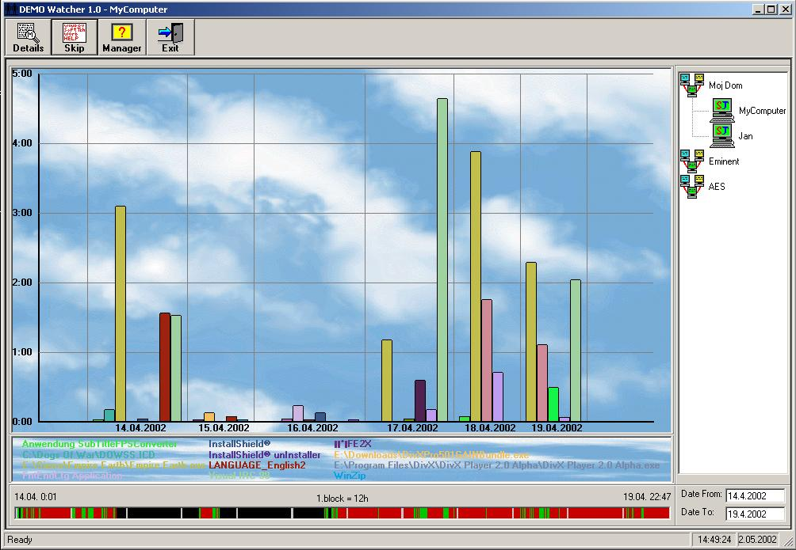

## Watcher

### Description

Watcher is server-client application. In zip file there are two files.

First is Writer. this actually monitor activity on your computer.

First it gets active window and its Hwnd, then convert this into thread ID and create snapshot if this is Win9x OS, if not there is no need for this because we can get threads for windows directly. Then compares hwnd and ThreadId to get correct thread and finally convert it to process.

Then all we have to do is find this process EXE and get app name from there. There are few different ways to get application name from exe file. This application also monitors keyboard and mouse activity just to see when user was working and when not.

All data are saved into database.

Second source is Watcher. This app connect to writer using TCP/IP protocol (winsock object). The protocol is similar to smpt protocol. I think this could be good example how protocol should look like. I had to wrote my own grid object for this project. The source and OCX is included also. Watcher have hidden functions which are visible if you start app with /SetUp parameter. The code is written somewhere in source of watcher. You can then communicate with writer's manually. Just type Help or check writers source.

This software was written few years ago so I don't remember now exactly how and could be some mistakes in description. This is the basically what this source do. If you need additional info let me know and I'll write more about functions and APIs in this source. Or you can contact me on my email.

Thanks, Mitja
 
### More Info
 

             |
---                |---
**Submitted On**   |2002-05-02 14:12:18
**By**             |[Mitja](https://github.com/Planet-Source-Code/PSCIndex/blob/master/ByAuthor/mitja.md)
**Level**          |Advanced
**User Rating**    |4.5 (18 globes from 4 users)
**Compatibility**  |VB 5\.0, VB 6\.0
**Category**       |[Complete Applications](https://github.com/Planet-Source-Code/PSCIndex/blob/master/ByCategory/complete-applications__1-27.md)
**World**          |[Visual Basic](https://github.com/Planet-Source-Code/PSCIndex/blob/master/ByWorld/visual-basic.md)
**Archive File**   |[Watcher78507522002\.zip](https://github.com/Planet-Source-Code/mitja-watcher__1-34344/archive/master.zip)

